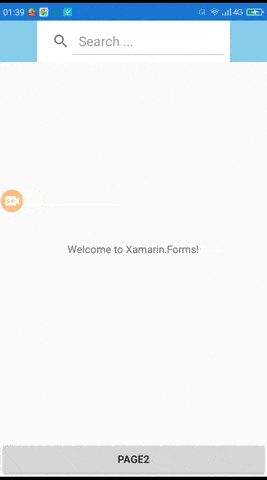
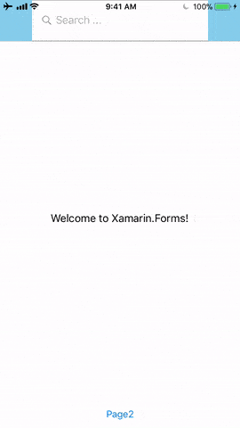

# SNavigation.Forms

SNavigation(Xamarin.Forms) allows you to put any elements on navigation bar.

[](https://www.nuget.org/packages/SNavigation.Forms/)

Supports Android and iOS.

## Screen-Shots

 

## Setup

* Install the [nuget package](https://www.nuget.org/packages/SNavigation.Forms) in portable and all platform specific projects.

### Android

In MainActivity.cs file

```
    Stormlion.SNavigation.Droid.Platform.Init(this);
```

### iOS

In AppDelegate.cs file

```
    Stormlion.SNavigation.iOS.Platform.Init();
```
## Usage

```
    MainPage = new SNavigationPage(new Page1())
    {
        BarBackgroundColor = Color.SkyBlue,
    };
```

```
	<ContentPage xmlns="http://xamarin.com/schemas/2014/forms"
				 xmlns:x="http://schemas.microsoft.com/winfx/2009/xaml"
				 xmlns:snav="clr-namespace:Stormlion.SNavigation;assembly=Stormlion.SNavigation"
				 x:Class="Test.Page1"
				 >
		<snav:SNavigationPage.NavContent>
			<Grid Margin="50, 0, 50, 0"
				  >
				<SearchBar BackgroundColor="White"
						   Placeholder="Search ..."
						   />
			</Grid>
		</snav:SNavigationPage.NavContent>
		<ContentPage.Content>
			...
		</ContentPage.Content>
	</ContentPage>
```

```
	<ContentPage xmlns="http://xamarin.com/schemas/2014/forms"
				 xmlns:x="http://schemas.microsoft.com/winfx/2009/xaml"
				 xmlns:snav="clr-namespace:Stormlion.SNavigation;assembly=Stormlion.SNavigation"
				 x:Class="Test.Page2"
				 >
		<snav:SNavigationPage.NavContent>
			<Grid Margin="50, 0, 50, 0">
				<Grid.ColumnDefinitions>
					<ColumnDefinition Width="1*" />
					<ColumnDefinition Width="1*" />
					<ColumnDefinition Width="1*" />
				</Grid.ColumnDefinitions>
				<BoxView Grid.Column="0"
						 BackgroundColor="LightGray"
						 />
				<BoxView Grid.Column="1"
						 BackgroundColor="LightBlue"
						 />
				<BoxView Grid.Column="2"
						 BackgroundColor="Orange"
						 />
			</Grid>
		</snav:SNavigationPage.NavContent>
		<ContentPage.Content>
			...
		</ContentPage.Content>
	</ContentPage>
```

## Contributions
Contributions are welcome!

## Contributors
* **[Marko Rothstein](https://www.facebook.com/profile.php?id=100014026622428)**
